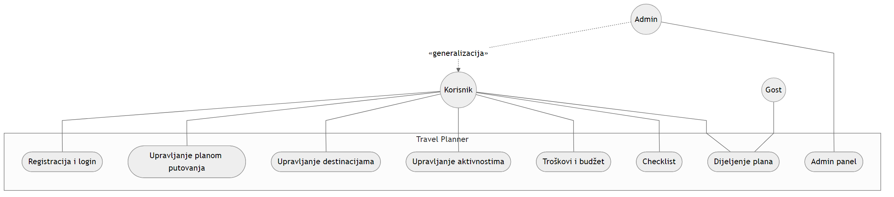

# TravelPlanner

Web aplikacija za planiranje putovanja — mikroservisna arhitektura na **Microsoft Service Fabric** sa **React** frontendom.

Korisnik na jednom mjestu organizuje plan putovanja: destinacije, dnevne aktivnosti, troškove, budžet, packing listu i dijeljenje plana putem linka ili QR koda (VIEW / EDIT).

---

## Dokumentacija

| Dokument | Opis |
|----------|------|
| [Arhitektura sistema](docs/system-architecture.md) | Servisi, baze, protokoli |
| [Use case dijagram](docs/use-case-diagram.md) | Aktori i funkcionalni zahtjevi |
| [PNG dijagrami](docs/diagrams/) | `system-architecture.png`, `use-case-diagram.png` |

**Arhitektura:**


**Use case:**



---

## Arhitektura

```
React Frontend
      │ HTTP / REST
      ▼
ApiGateway [Stateless] — JWT, CORS, autorizacija
      │ Service Fabric Remoting
      ├── UserService [Stateless]        → UserServiceDB
      ├── TravelPlanService [Stateful]   → TravelPlanServiceDB
      ├── ExpenseService [Stateful]      → ExpenseServiceDB
      └── ChecklistService [Stateless]   → ChecklistServiceDB
```

| Servis | SF tip | Odgovornost |
|--------|--------|-------------|
| ApiGateway | Stateless | HTTP ulaz, JWT, orkestracija brisanja |
| UserService | Stateless | Registracija, login, uloge |
| TravelPlanService | Stateful | Planovi, destinacije, aktivnosti, share tokeni |
| ExpenseService | Stateful | Troškovi, kategorije, budžet |
| ChecklistService | Stateless | Packing lista |

---

## Tehnologije

**Backend:** .NET 8 · Service Fabric · ASP.NET Core · EF Core · SQL Server · JWT · BCrypt · QRCoder

**Frontend:** React 19 · Vite · Tailwind CSS · Axios · Context API · React Router

---

## Preduslovi

| Alat | Verzija |
|------|---------|
| Windows | 10 / 11 |
| .NET SDK | 8.0+ |
| Visual Studio | 2022 (ASP.NET + Azure workloads) |
| Service Fabric SDK | 10.x |
| SQL Server | 2019+ |
| Node.js | 20+ |

---

## Pokretanje

### 1. Baza podataka

Postoje **dva koraka** — prazne baze se kreiraju skriptom, **tabele** kroz EF Core migracije:

| Korak | Šta radi | Gdje |
|-------|----------|------|
| 1 | Kreira SQL login, 4 prazne baze i dozvole | `database/setup-databases.sql` (pokrenuti u SSMS) |
| 2 | Kreira tabele i primjenjuje promjene sheme | EF Core migracije pri startu svakog servisa |

Skripta **ne kreira tabele** — samo infrastrukturu (login + prazne baze). Tabele generiše kod:

```csharp
db.Database.Migrate();  // u Program.cs svakog servisa
```

**Migracije u projektu:**

| Servis | Folder |
|--------|--------|
| UserService | `UserService/Migrations/` |
| TravelPlanService | `TravelPlanService/Migrations/` |
| ExpenseService | `ExpenseService/Migrations/` |
| ChecklistService | `ChecklistService/Migrations/` |

Svaki mikroservis koristi sopstvenu bazu:

| Servis | Baza |
|--------|------|
| UserService | `UserServiceDB` |
| TravelPlanService | `TravelPlanServiceDB` |
| ExpenseService | `ExpenseServiceDB` |
| ChecklistService | `ChecklistServiceDB` |

Connection stringovi: `appsettings.json` u svakom servisu. Migracije se primjenjuju pri startu servisa.

**Default admin nalog** (kreira se pri prvom startu UserService-a):

| Email | Lozinka | Uloga |
|-------|---------|-------|
| `admin@admin.com` | `Admin123!` | Admin |

### 2. Backend

1. Pokrenuti **Service Fabric Local Cluster** (1-node ili 5-node).
2. Otvoriti `TravelPlannerApp/TravelPlannerApp.sln` u Visual Studio.
3. Startup project: **TravelPlannerApp**.
4. Publish profil: `Local.1Node` ili `Local.5Node`.
5. Deploy (F5).
6. Provjera: Service Fabric Explorer — `http://localhost:19080`
7. API: `http://localhost:8387`

### 3. Frontend

```bash
cd frontend
npm install
cp .env.example .env
npm run dev
```

Aplikacija: `http://localhost:5173`

`.env`:

```env
VITE_API_URL=http://localhost:8387
```

---

## Uloge

| Uloga | Ovlaštenja |
|-------|------------|
| User | CRUD nad sopstvenim planovima, destinacijama, aktivnostima, troškovima, checklistom; dijeljenje plana |
| Admin | Sve kao User + admin panel (korisnici i svi planovi u sistemu) |
| Gost | Pristup dijeljenom planu preko share tokena (VIEW ili EDIT) |

---

## API

Base URL: `http://localhost:8387`

Zaštićeni endpointi zahtijevaju header: `Authorization: Bearer <token>`

| Resurs | Prefix |
|--------|--------|
| Auth | `/api/auth` |
| Korisnici | `/api/users` |
| Planovi | `/api/travel-plans` |
| Destinacije | `/api/destinations` |
| Aktivnosti | `/api/activities` |
| Troškovi | `/api/expenses` |
| Checklist | `/api/checklist` |
| Dijeljenje | `/api/sharing` |

---

## Struktura projekta

```
TravelPlannerApp/
├── database/setup-databases.sql
├── docs/                          # dijagrami i dokumentacija
├── TravelPlannerApp/              # Service Fabric aplikacija
├── ApiGateway/
├── UserService/
├── TravelPlanService/
├── ExpenseService/
├── ChecklistService/
├── TravelPlanner.Shared/          # DTO, interfejsi
└── frontend/                      # React SPA
```

---

## Funkcionalnosti

- Registracija i login (JWT, heširane lozinke)
- CRUD plan putovanja (validacija datuma i budžeta)
- Destinacije, aktivnosti (lista + kalendar)
- Troškovi po kategorijama, automatski budžet
- Packing checklist
- Dijeljenje plana (VIEW / EDIT, QR kod)
- Admin panel
- PDF export pregleda plana

---

## Service Fabric replike

| Profil | Stateful servisi | Stateless servisi |
|--------|------------------|-------------------|
| `Local.5Node` | min 3, target 3 replike | 1 instanca |
| `Local.1Node` | 1 replika | 1 instanca |

Konfiguracija: `StartupServices.xml`, `StartupServiceParameters/Local.*.xml`

---

## Licenca

Projekat iz predmeta *Primena veb programiranja u infrastrukturnim sistemima*.
