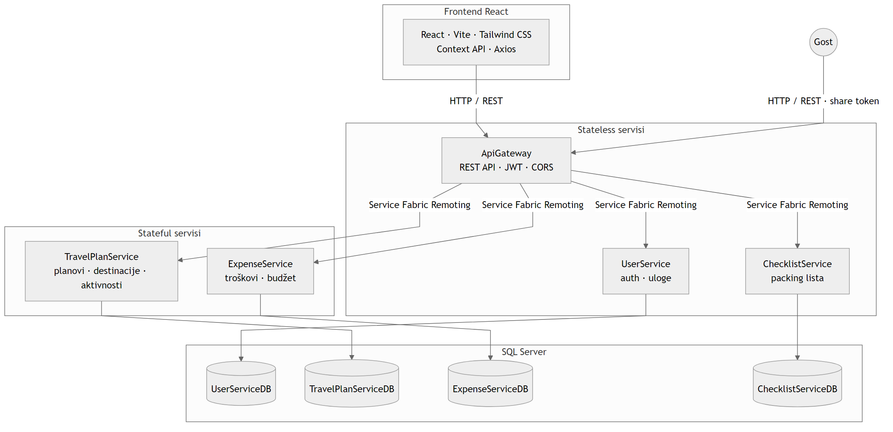

# TravelPlanner — Arhitektura sistema

Mikroservisna arhitektura na Microsoft Service Fabric platformi.

## Komponente

| Komponenta | SF tip | Odgovornost | Baza |
|------------|--------|-------------|------|
| **ApiGateway** | Stateless | HTTP ulaz, JWT, CORS, validacija korisnika, orkestracija brisanja | — |
| **UserService** | Stateless | Registracija, login, BCrypt, JWT, uloge | `UserServiceDB` |
| **TravelPlanService** | Stateful | Planovi, destinacije, aktivnosti, share tokeni; SQL + `IReliableDictionary` cache | `TravelPlanServiceDB` |
| **ExpenseService** | Stateful | Troškovi, kategorije, budžet; SQL + `IReliableDictionary` cache | `ExpenseServiceDB` |
| **ChecklistService** | Stateless | Packing lista | `ChecklistServiceDB` |

## Protokoli komunikacije

| Veza | Protokol |
|------|----------|
| Frontend → ApiGateway | HTTP / REST |
| Gost → ApiGateway | HTTP / REST (share token) |
| ApiGateway → mikroservisi | Service Fabric Remoting |
| Mikroservisi → SQL Server | Entity Framework Core |

## Tok brisanja korisnika

ApiGateway orkestrira kaskadno brisanje:

1. Dohvati sve planove korisnika (TravelPlanService)
2. Za svaki plan obriši troškove (ExpenseService) i checklist (ChecklistService)
3. Obriši planove korisnika (TravelPlanService)
4. Obriši korisnika (UserService)

## Napomene

- **Database-per-service** — logičke veze između servisa (npr. `TravelPlanId`)
- **ApiGateway** je jedini HTTP ulaz prema frontendu
- **Stateful servisi** — SQL Server je izvor istine (trajna perzistencija, backup, pristup van klastera); **ReliableDictionary** na repliki drži runtime cache (npr. plan po ID, budžet summary) koji se invalidira pri upisima
- **JWT** — validacija potpisa i isteka; middleware provjerava postojanje korisnika u bazi
- **Dijeljenje** — VIEW link/QR bez login-a; EDIT link/QR zahtijeva JWT + validan EDIT token
