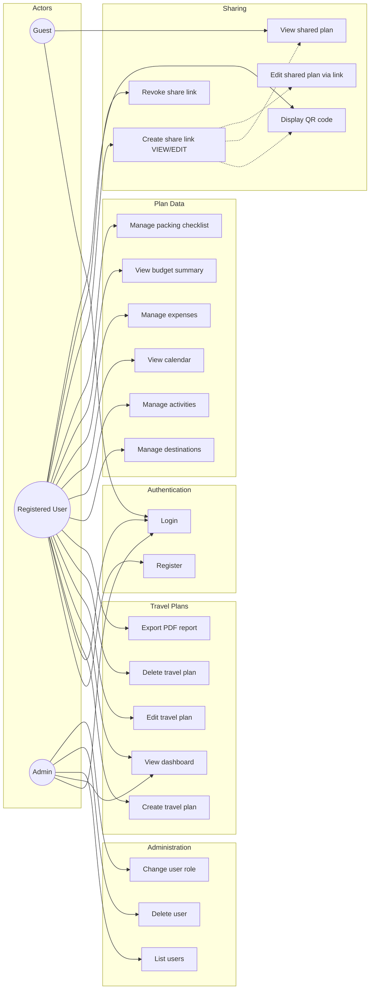

# TravelPlanner — Use Case Diagram

Actors and use cases aligned with the project specification (excluding the optional route-map extension).

## Actor summary

| Actor | Description |
|-------|-------------|
| **Guest** | Can open a shared link (VIEW) and sign in |
| **Registered User** | Owns travel plans; full CRUD and sharing |
| **Admin** | User management plus all user capabilities |

## Shared link access

| Access type | Allowed use cases |
|-------------|-------------------|
| **VIEW** | View plan, destinations, activities, checklist (read-only) |
| **EDIT** | VIEW + add/delete destinations and activities |
