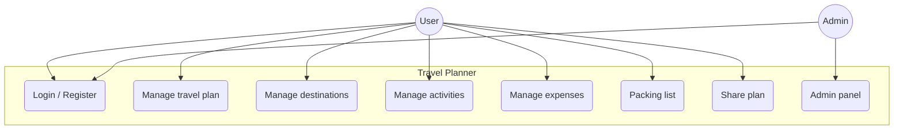

# TravelPlanner — Use Case Diagram

Specification scope (route-map extension excluded).

## Diagram

**Shared link (no account):** guest opens link → *View plan* (VIEW) or *Edit destinations/activities* (EDIT).

## Actors

| Actor | Description |
|-------|-------------|
| User | Registered user |
| Admin | Manages users |

## Use cases

| # | Use case | Note |
|---|----------|------|
| 1 | Login / Register | JWT |
| 2 | Manage travel plan | CRUD, dates, budget |
| 3 | Manage destinations | Within trip dates |
| 4 | Manage activities | List and calendar |
| 5 | Manage expenses | Categories, budget summary |
| 6 | Packing list | Toggle items |
| 7 | Share plan | VIEW / EDIT link, QR code |
| 8 | Admin panel | Users: list, delete, role |
